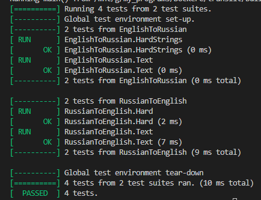

<h1>Задача: Перевод латинской транслитерации в кириллицу и наоборот.</h1>

Язык: <b>C++</b>.

Таблицы переводов взяты с [ГОСТ](https://internet-law.ru/gosts/gost/58177/) 
Алгоритм ищет самую длинную замену, так что слово vyudit заменяет на вюдит, а не выудит.

<b>ТЕСТЫ:</b>

<h5>Тестовые значения:</h5>

esli ==> если  
yolka ==> ёлка  
ob``em ==> объем  
ob``yom ==> объём  
uznaesh` ==> узнаешь  
uznayosh` ==> узнаёшь  
Chajkovskij ==> Чайковский  
chaj ==> чай  
zajka ==> зайка  
jogurt ==> йогурт  
major ==> майор  
rajon ==> район  
novye ==> новые  
opyat` ==> опять  
cifra ==> цифра  
me`r ==> мэр  
shhit ==> щит  
schitka ==> считка  

Текст

Translit (sokrashhenno ot «transliteraciya») — e`to napisanie slov odnogo yazyka bukvami drugogo. Kak pravilo, translitom nazyvayut kirillicheskij tekst, napisannyj latinskimi bukvami. Naprimer, vopros Kak perevesti russkij v translit? mozhet byt` napisan Kak perevesti russkij v translit?

В 

 Транслит (сокращенно от «транслитерация») — это написание слов одного языка буквами другого. Как правило, транслитом называют кириллический текст, написанный латинскими буквами. Например, вопрос Как перевести русский в транслит? может быть написан Как перевести русский в транслит? 
